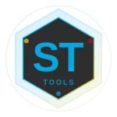

# ST Tools Hub

<div align="center">



**Launcher centralizzato per applicazioni DHL Express Italy**

[](https://www.electronjs.org/)
[](https://nodejs.org/)
[](LICENSE)

**Created by Simone Tosello (ST)**

Developer @ DHL Express Italy

</div>

---

## 📋 Indice

- [Panoramica](#-panoramica)
- [Caratteristiche](#-caratteristiche)
- [Applicazioni Incluse](#-applicazioni-incluse)
- [Requisiti](#-requisiti)
- [Installazione](#-installazione)
- [Sviluppo](#-sviluppo)
- [Build e Distribuzione](#-build-e-distribuzione)
- [Configurazione](#-configurazione)
- [Come Aggiungere Nuove App](#-come-aggiungere-nuove-app)
- [Architettura](#-architettura)
- [Tecnologie](#-tecnologie)
- [Autore](#-autore)

---

## 🎯 Panoramica

**ST Tools Hub** è un launcher centralizzato in stile Steam/Epic Games per gestire e avviare le applicazioni desktop sviluppate da Simone Tosello (ST) per DHL Express Italy.

Offre un'interfaccia unificata e moderna per:
- ✅ Avviare rapidamente le applicazioni installate
- 🔄 Controllare e installare aggiornamenti
- 📊 Visualizzare lo stato di tutte le app in un colpo d'occhio
- 🎨 UI moderna con branding DHL e ST

---

## ✨ Caratteristiche

### Core Features
- **Dashboard Moderna**: Interfaccia ispirata a Steam con card app interattive
- **Lancio App**: Avvia applicazioni esterne (.exe) con un click
- **Sistema Aggiornamenti**: Controllo automatico updates da GitHub Releases
- **Auto-Update Hub**: Il launcher si aggiorna automaticamente
- **Toast Notifications**: Notifiche eleganti per feedback utente
- **Settings Panel**: Configurazione personalizzata

### Design & UX
- **Tema Dark**: Design moderno con colori DHL (Giallo #FFCC00, Rosso #D40511) e ST Blue (#00A8E1)
- **Animazioni Fluide**: Hover effects, transizioni smooth
- **Responsive**: Layout adattivo per diverse risoluzioni
- **Branding ST**: Logo e firma Simone Tosello prominenti

### Sicurezza
- **Context Isolation**: Electron con sandboxing sicuro
- **IPC Bridge**: Comunicazione main-renderer tramite preload sicuro
- **No Node Integration**: Renderer process isolato

---

## 📦 Applicazioni Incluse

ST Tools Hub gestisce le seguenti applicazioni:

### 1. **Generatore Bollettini** (v1.0.3)
Generazione automatizzata bollettini sanità da file Excel
- **Categoria**: Customs
- **Repository**: [bollettini](https://github.com/ToseSenpai/bollettini)

### 2. **Cerca MRN** (v1.0.0)
Tool per ricerca veloce MRN nel sistema
- **Categoria**: Logistics
- **Repository**: [cerca-mrn](https://github.com/ToseSenpai/cerca-mrn)

### 3. **Controllo Stato NSIS** (v1.0.0)
Monitoraggio e controllo stato NSIS in tempo reale
- **Categoria**: Monitoring
- **Repository**: [ControlloStatoNSIS](https://github.com/ToseSenpai/ControlloStatoNSIS)

---

## 🔧 Requisiti

### Requisiti di Sistema
- **OS**: Windows 10/11 (64-bit)
- **RAM**: Minimo 4GB
- **Spazio Disco**: 500MB per il launcher + spazio per le app

### Requisiti di Sviluppo
- **Node.js**: v20.x o superiore
- **npm**: v10.x o superiore
- **Git**: Per clonare il repository

---

## 🚀 Installazione

### Per Utenti Finali

1. **Scarica l'installer**:
   - Vai alla pagina [Releases](https://github.com/ToseSenpai/ST-Tools-Hub/releases/latest)
   - Scarica `ST-Tools-Hub-Setup-X.X.X.exe`

2. **Esegui l'installer**:
   - Doppio click su `ST-Tools-Hub-Setup-X.X.X.exe`
   - Scegli la cartella di installazione
   - Completa l'installazione

3. **Avvia ST Tools Hub**:
   - Dal menu Start o dal desktop shortcut
   - Al primo avvio, le app non saranno installate

4. **Installa le applicazioni**:
   - Click su "Installa" nelle card delle app
   - Scarica e installa le app desiderate
   - Riavvia ST Tools Hub per vedere le app installate

### Per Sviluppatori

```bash
# Clone repository
git clone https://github.com/ToseSenpai/ST-Tools-Hub.git
cd ST-Tools-Hub

# Installa dipendenze
npm install

# Avvia in modalità sviluppo
npm start

# Oppure con DevTools
npm run dev
```

---

## 💻 Sviluppo

### Struttura del Progetto

```
st-tools-hub/
├── main.js                 # Electron main process
├── preload.js             # Preload script (IPC bridge)
├── package.json           # Dependencies & config
│
├── src/
│   ├── main/              # Backend Node.js modules
│   │   ├── app-launcher.js     # Lancia app esterne
│   │   ├── update-checker.js   # Check GitHub updates
│   │   └── config-manager.js   # Gestione config
│   │
│   └── renderer/          # Frontend UI
│       ├── index.html     # Main HTML
│       ├── styles/        # CSS files
│       │   ├── main.css
│       │   ├── dashboard.css
│       │   └── cards.css
│       ├── js/            # Frontend logic
│       │   ├── renderer.js     # Main UI controller
│       │   ├── app-manager.js  # App cards logic
│       │   └── updater.js      # Update UI logic
│       └── assets/        # Icons, logos, images
│
├── config/
│   └── apps-registry.json # Registro app disponibili
│
├── build/                 # Build resources
│   ├── icon.ico
│   └── icon.png
│
└── apps/                  # App installate (runtime, gitignored)
```

### Scripts Disponibili

```bash
# Sviluppo
npm start              # Avvia app Electron
npm run dev            # Avvia con DevTools aperte

# Build
npm run build          # Build per Windows
npm run build-win      # Build Windows esplicito

# Publish (richiede GitHub token)
npm run publish        # Build e pubblica su GitHub Releases
```

### Workflow di Sviluppo

1. **Modifica codice** in `src/`
2. **Testa** con `npm start`
3. **Build** con `npm run build`
4. **Test installer** in `dist/`
5. **Commit** e **Push**
6. **Release** con `npm run publish`

---

## 📦 Build e Distribuzione

### Build Locale

```bash
npm run build
```

Questo crea:
- `dist/ST-Tools-Hub-Setup-X.X.X.exe` - Installer NSIS
- `dist/win-unpacked/` - Versione portable

### Pubblicazione Release

1. **Aggiorna versione** in `package.json`:
   ```json
   "version": "1.0.1"
   ```

2. **Commit cambiamenti**:
   ```bash
   git add .
   git commit -m "Release v1.0.1"
   git push
   ```

3. **Crea tag**:
   ```bash
   git tag v1.0.1
   git push --tags
   ```

4. **Pubblica su GitHub**:
   ```bash
   npm run publish
   ```

   Oppure manualmente su GitHub Releases.

### Auto-Update

Il launcher si aggiorna automaticamente tramite `electron-updater`:
- Controlla updates all'avvio
- Scarica in background
- Notifica utente quando pronto
- Installa al riavvio

---

## ⚙️ Configurazione

### apps-registry.json

Il file `config/apps-registry.json` contiene la lista delle app disponibili:

```json
{
  "apps": [
    {
      "id": "bollettini",
      "name": "Generatore Bollettini",
      "description": "Descrizione app",
      "version": "1.0.3",
      "icon": "./src/renderer/assets/icons/bollettini.png",
      "executablePath": "./apps/bollettini/GeneratoreBollettini.exe",
      "repoOwner": "ToseSenpai",
      "repoName": "bollettini",
      "category": "Customs",
      "backgroundColor": "#FF6B6B"
    }
  ]
}
```

### Settings Utente

Le impostazioni sono salvate in `localStorage`:
- `autoUpdate`: Controlla updates all'avvio (default: true)
- `notifications`: Mostra notifiche (default: true)

---

## ➕ Come Aggiungere Nuove App

### Step 1: Prepara l'App

1. Crea repository GitHub per la nuova app
2. Configura releases con tag versione (es: `v1.0.0`)
3. Pubblica installer/exe nelle release assets

### Step 2: Aggiungi al Registry

Modifica `config/apps-registry.json`:

```json
{
  "id": "nuova-app",
  "name": "Nome App",
  "description": "Descrizione breve",
  "version": "1.0.0",
  "icon": "./src/renderer/assets/icons/nuova-app.png",
  "executablePath": "./apps/nuova-app/NuovaApp.exe",
  "repoOwner": "ToseSenpai",
  "repoName": "nuova-app",
  "category": "Categoria",
  "backgroundColor": "#4ECDC4"
}
```

### Step 3: Aggiungi Icona (Opzionale)

Aggiungi icona 64x64px in:
```
src/renderer/assets/icons/nuova-app.png
```

### Step 4: Test

1. Avvia hub: `npm start`
2. Verifica che la card appaia
3. Testa installazione e lancio app

### Step 5: Rebuild e Pubblica

```bash
npm run build
npm run publish
```

---

## 🏗️ Architettura

### Main Process (Node.js)

- **main.js**: Entry point, gestisce finestra e lifecycle
- **app-launcher.js**: Spawn processi child per lanciare .exe
- **update-checker.js**: Query GitHub API per updates
- **config-manager.js**: Load/save configurazioni

### Renderer Process (Frontend)

- **index.html**: Struttura UI
- **CSS**: Styling con variabili CSS per theming
- **renderer.js**: Controller principale UI
- **app-manager.js**: Logica card app, lancio, updates
- **updater.js**: Background update checks

### IPC Communication

```
Renderer Process ←→ Preload (contextBridge) ←→ Main Process
```

Sicuro tramite context isolation e API esposte selettivamente.

---

## 🛠️ Tecnologie

### Core
- **Electron** 31.7.7 - Framework app desktop
- **Node.js** - Backend runtime
- **HTML5/CSS3** - Frontend UI
- **JavaScript ES6+** - Logica applicazione

### Libraries
- **electron-updater** 6.6.2 - Auto-update sistema
- **electron-builder** 25.1.8 - Build e packaging

### Design
- **CSS Variables** - Theming dinamico
- **CSS Grid** - Layout responsive
- **CSS Animations** - Effetti smooth

---

## 👤 Autore

<div align="center">

### **Simone Tosello (ST)**

Developer @ **DHL Express Italy**

[](https://github.com/ToseSenpai)
[](mailto:simone.tosello@dhl.com)

</div>

---

## 📄 License

MIT License

Copyright (c) 2025 Simone Tosello

Permission is hereby granted, free of charge, to any person obtaining a copy
of this software and associated documentation files (the "Software"), to deal
in the Software without restriction, including without limitation the rights
to use, copy, modify, merge, publish, distribute, sublicense, and/or sell
copies of the Software, and to permit persons to whom the Software is
furnished to do so, subject to the following conditions:

The above copyright notice and this permission notice shall be included in all
copies or substantial portions of the Software.

THE SOFTWARE IS PROVIDED "AS IS", WITHOUT WARRANTY OF ANY KIND, EXPRESS OR
IMPLIED, INCLUDING BUT NOT LIMITED TO THE WARRANTIES OF MERCHANTABILITY,
FITNESS FOR A PARTICULAR PURPOSE AND NONINFRINGEMENT. IN NO EVENT SHALL THE
AUTHORS OR COPYRIGHT HOLDERS BE LIABLE FOR ANY CLAIM, DAMAGES OR OTHER
LIABILITY, WHETHER IN AN ACTION OF CONTRACT, TORT OR OTHERWISE, ARISING FROM,
OUT OF OR IN CONNECTION WITH THE SOFTWARE OR THE USE OR OTHER DEALINGS IN THE
SOFTWARE.

---

## 🙏 Acknowledgments

- **DHL Express Italy** - Per il supporto allo sviluppo
- **Electron Community** - Per framework e documentazione
- **GitHub** - Per hosting e releases

---

<div align="center">

**ST Tools Hub** - Developed with ❤️ by **Simone Tosello (ST)**

© 2025 DHL Express Italy

</div>
